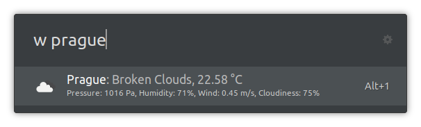

# Weather extension for Ulauncher using data from OpenWeatherMap.org

  

With this Ulauncher extension, you can quickly check the recent weather at given city.

## Installation

- Launch **Ulauncher**
- Click the ⚙️ icon next to the search field
- Click on the **Extensions** tab
- Click on ➕ **Add extension**
- Paste `https://github.com/fajtak/ulauncher-weather`
- Click **Add**

## Usage

First of all go to `OpenWeathermap.org/api`. Sign up and create your own API KEY. Copy the API key to the Ulaunchers' OpenWeatherMap extension.

Try `w Prague`